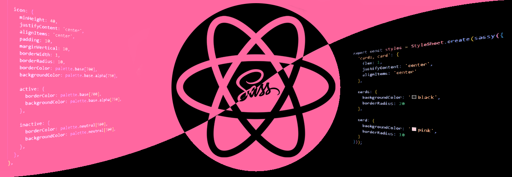

<div align="center">
    
    <h1>NativeSass</h1>
    <p><strong>Syntactically Awesome StyleSheets the Native Way</strong><br>
    Use Sass styling features with React Native</p>

[](https://npmjs.com/package/native-sass)
[](https://npmjs.com/package/native-sass)
[](https://github.com/filipe-2/native-sass/blob/main/LICENSE)
[](https://expo.dev/client)
</div>

<br>

## ⚛️ About

A React Native library that lets you create StyleSheets with Sass- and CSS-like functionality, like nesting and shared styles. With this library, you can nest styles, use shared styles to apply properties to multiple style objects at once, and much more, without losing the default experience of creating StyleSheets the React Native way.

## ⚛️ Installation

To use `native-sass` in your React Native project, just run this command from your terminal if you're using `npm`:

```bash
npm install native-sass
```

Or use the following if you're using `yarn`:

```bash
yarn add native-sass
```

## ⚛️ Features

### ▶ Nesting

Consider the following StyleSheet:

```js
import { StyleSheet } from 'react-native';

const styles = StyleSheet.create({
  // ...
  dialogWrapper: {
    padding: 20,
    backgroundColor: 'white',
    borderRadius: 8,
    shadowColor: 'black',
    shadowOpacity: 0.1,
    shadowOffset: {
      width: 0,
      height: 2,
    },
    shadowRadius: 4,
  },

  dialogTitle: {
    fontSize: 18,
    fontWeight: 'bold',
    color: '#333',
    marginBottom: 10,
  },

  dialogMsg: {
    fontSize: 16,
    color: '#666',
    marginBottom: 20,
  },

  dialogActionsBtn: {
    paddingVertical: 10,
    paddingHorizontal: 15,
    backgroundColor: '#007BFF',
    borderRadius: 4,
  },

  dialogActionsBtnText: {
    fontSize: 14,
    color: 'white',
    fontWeight: 'bold',
    textAlign: 'center',
  },
  // ...
});
```

This `StyleSheet` defines styles for a dialog component, with separate styles for its wrapper, title, message, and action buttons. However, we might want to nest those style rules for organization, maintainability, and to avoid redundancy (notice that we're repeating the name of the component in each object).

To use nesting, we can just pass our custom `StyleSheet` with nested objects to the `sassy` function from `native-sass` as follows:

```js
import { StyleSheet } from 'react-native';
import { sassy } from 'native-sass';

const styles = StyleSheet.create(sassy({
  // ...
  dialog: {
    wrapper: {
      padding: 20,
      backgroundColor: 'white',
      borderRadius: 8,
      shadowColor: 'black',
      shadowOpacity: 0.1,
      shadowOffset: {
        width: 0,
        height: 2,
      },
      shadowRadius: 4,
    },

    title: {
      fontSize: 18,
      fontWeight: 'bold',
      color: '#333',
      marginBottom: 10,
    },

    msg: {
      fontSize: 16,
      color: '#666',
      marginBottom: 20,
    },

    actions: {
      btn: {
        paddingVertical: 10,
        paddingHorizontal: 15,
        backgroundColor: '#007BFF',
        borderRadius: 4,

        text: {
          fontSize: 14,
          color: 'white',
          fontWeight: 'bold',
          textAlign: 'center',
        },
      },
    },
  },
  // ...
}));
```

This object passed to `sassy` will be flattened into the `StyleSheet` of the previous snippet. The nested keys are capitalized and concatenated with the parent keys, so `dialog.actions.btn.text` becomes `dialogActionsBtnText`. The nested styles are then merged in order to return the object that the `StyleSheet.create()` method expects.

Notice that the amount of nesting is up to you to decide, while some degree of nesting helps organizing styles, too much nesting may cause confusion.

### ▶ Shared values

Suppose we have the following stylesheet:

```javascript
import { StyleSheet } from 'react-native';

const styles = StyleSheet.create({
  // ...
  cards: {
    width: 200,
    minHeight: 200,
    borderRadius: 25,
    borderWidth: 2,
    borderColor: 'red',
    justifyContent: 'center',
    alignItems: 'center',
    gap: 8,
    backgroundColor: 'black'
  },

  card: {
    width: 50,
    minHeight: 50,
    borderWidth: 2,
    borderColor: 'red',
    justifyContent: 'center',
    alignItems: 'center',
    backgroundColor: 'pink'
  },
  // ...
});
```

We can recycle these shared styles as follows with the `sassy` function:

```javascript
import { StyleSheet } from 'react-native';
import { sassy } from 'native-sass';

const styles = StyleSheet.create(sassy({
  // ...
  'cards, card': {
    borderWidth: 2,
    borderColor: 'red',
    justifyContent: 'center',
    alignItems: 'center'
  },

  cards: {
    width: 200,
    minHeight: 200,
    borderRadius: 25,
    gap: 8,
    backgroundColor: 'black'
  },

  card: {
    width: 50,
    minHeight: 50,
    backgroundColor: 'pink'
  }
  // ...
}));
```

We wrap the keys we want to apply the shared styles to with quotes and separate them with commas.

## ⚛️ Built-in JS functionalities

Some Sass functionalities, like mixins and maps, can be mimicked using built-in JS capabilities.

### ▶ Mixins

Mixins can be applied to a style object using the built-in JavaScript spread operator `...`, so no need to use `sassy` (unless nesting or shared styles are present). Example:

```javascript
import { StyleSheet } from 'react-native';

const calculateSpacing = (value) => ({
  padding: value,
  margin: value / 2
});

const styles = StyleSheet.create({
  card: {
    color: 'white',
    width: 50,
    height: 50,
    ...calculateSpacing(20),
  }
});
```

## 🌟 **Support Us by Starring the Repo!** 🌟

<div>
  
  <p>
    If you find this project helpful, inspiring, or just plain awesome, please give it a ⭐!
  </p>
  <p>
    Your support encourages us and helps us keep the project growing more and more. 💖
  </p>
</div>

### How to Star:
1. If you're signed in, click the **Star** button at the top of this page.
